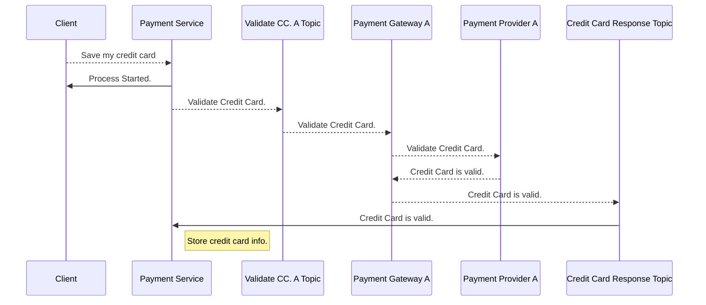
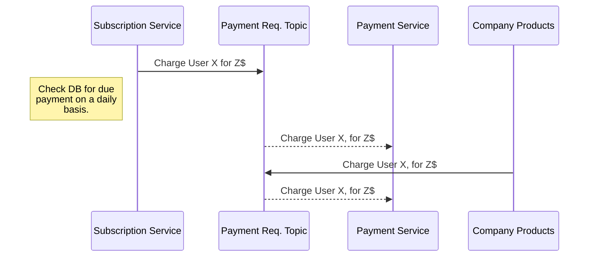
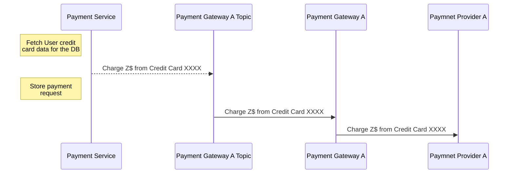
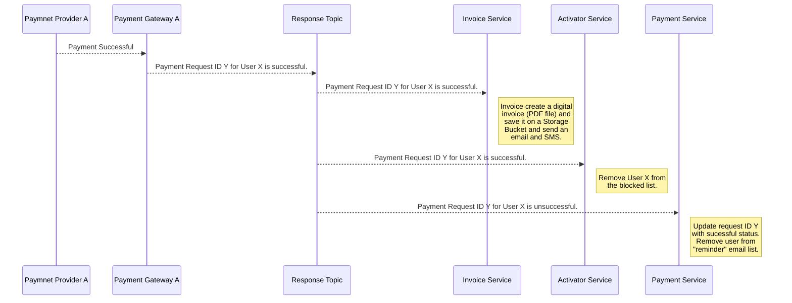
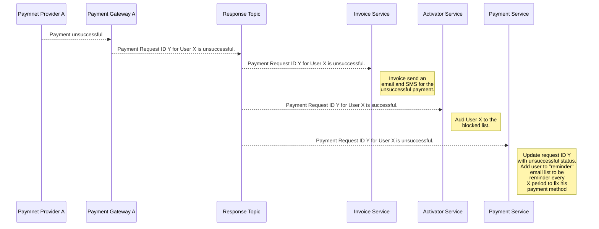
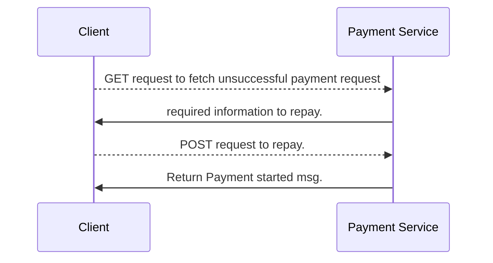
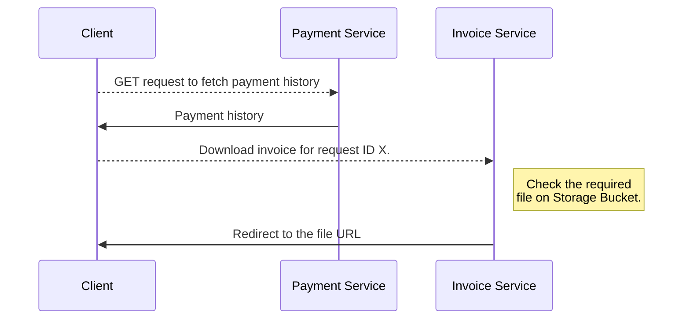
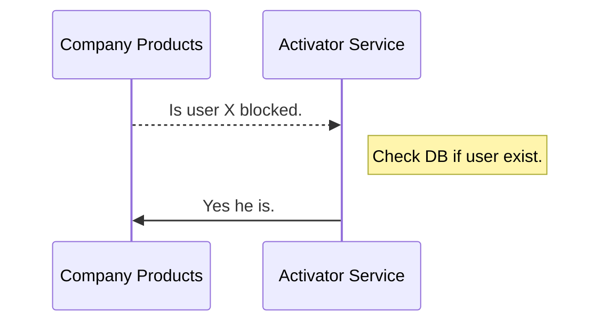

- **Payment Service** listen on **Payment Requests Topic** on receiving a message it will fetch user credit card info from its DB and prepare and publish a message on **Payment   Gateway Topic**.
- **Subscription Service** store user subscriptionsdata. Will have a daily  job to start payment process by publishing message to **Payment Requests Topic** .
- **Payment Gateway A, B, ... Service** listen on **Payment Gateway A, B, ... Topic** And start a payment process with a Payment Provider. After processing it will publish a message on **Response Topic**
- **Invoice Service** listen on **Response Topic** on receiving a successful message it will create a digital invoice (PDF file) and save it on a **Storage Bucket** and send an email and SMS.
- **Payment Service** listen on **Response Topic** and update DB with the request status, In case of unsuccessful request it  notify the user to fix his payment method.
- **Payment Service** store every transaction and can supply user with payment history.
- **Notifier Service** can supply the user with digital invoices.
- **Activator Service** listen on **Response Topic** and store if a user can't access Company products.

**Save and Validate Credit Card**

**Requesting Payment**

**Processing Payment Request**

**Successful Payment Request**

**Unsuccessful Payment Request**

**Manual Payment**

**Billing History**

**Company Products ask for active user**

**Technologies**
-  Services could use Go for its speed and Cloud features.
- Messaging Service could use Google Pub/Sub for easy of setup and uses. That would introduce the necessity of handling [duplicate messages](https://cloud.google.com/pubsub/docs/faq#duplicates) and [messages order](https://cloud.google.com/pubsub/docs/faq#order). Another option is to used Kafka but that will introduce complexity compared to Google Pub/Sub.
- DB could be a NoSQL database as Google Datastore for the benefit of horizontal scalability.

**Notes**
- User will get a token at login and it will be used for REST APIs authentication. 
- Every service will store in its DB the minimal User representation required by the service to operate.
- Every service will build upon a **Service Template** where we keep shared logic sync as Token Verification, Logging and Monitoring.